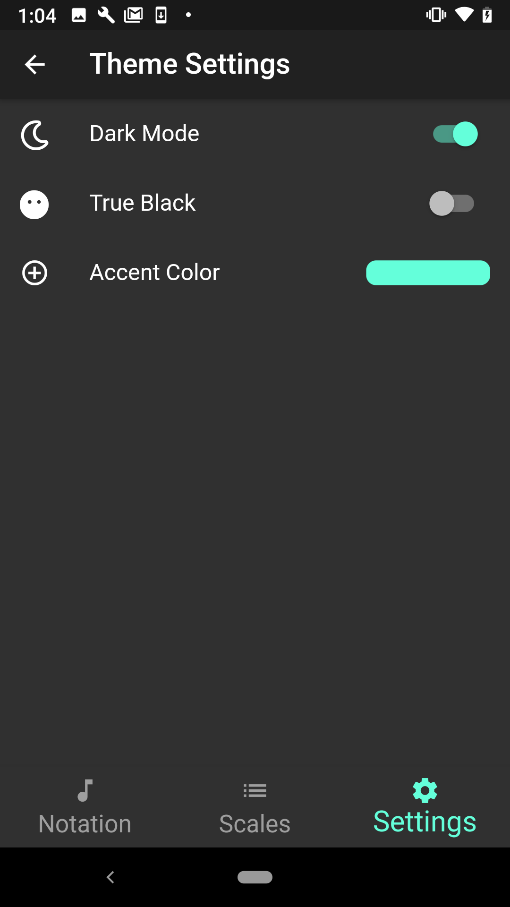

## About

Have trouble reading sheet music? Take the guess out of notation!

If you are like me then you have a hard time remembering the pitch or scale for a given measure quickly. Whenever it is time to perform it is important to play the starting note quickly. If you play or sing music by ear, sheet music may not be the fastest thing to read under pressure.

With this app simply tap on and choose the scale and the same for the pitch. There is even a preview for each pitch whether it is # or b.

This is a companion app to The Pitch Pipe and Sheet Music Pro, offered for free to have a lightweight tool for music notation.

If you have any problems with the app contact support and I will address it quickly. If you have any feedback or ideas about future development also please reach out! I am not some massive company, just one developer trying to make high-quality apps that I use regularly.

## Download

Google Play             |  AppStore
:-------------------------:|:-------------------------:
  |  

## Screenshots

