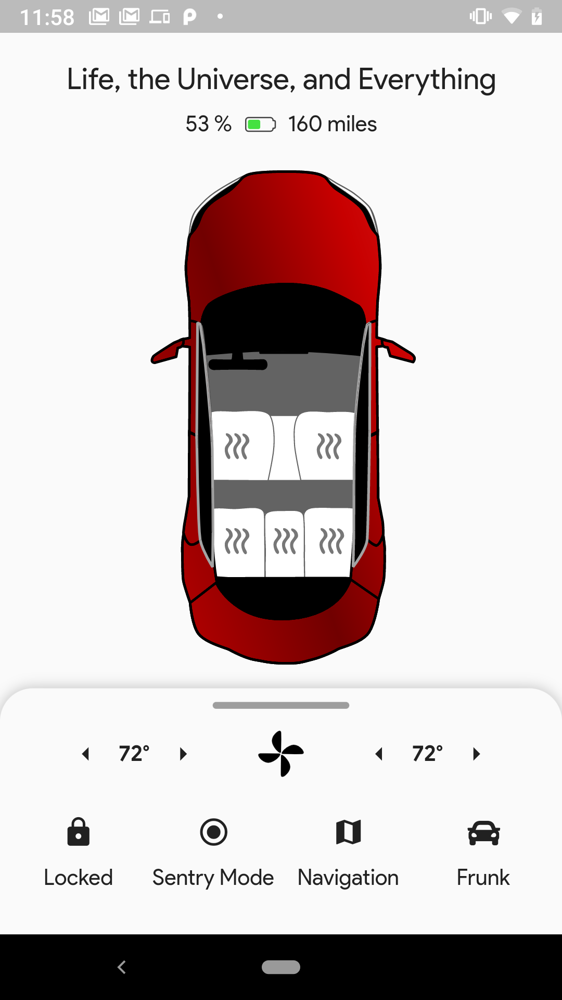
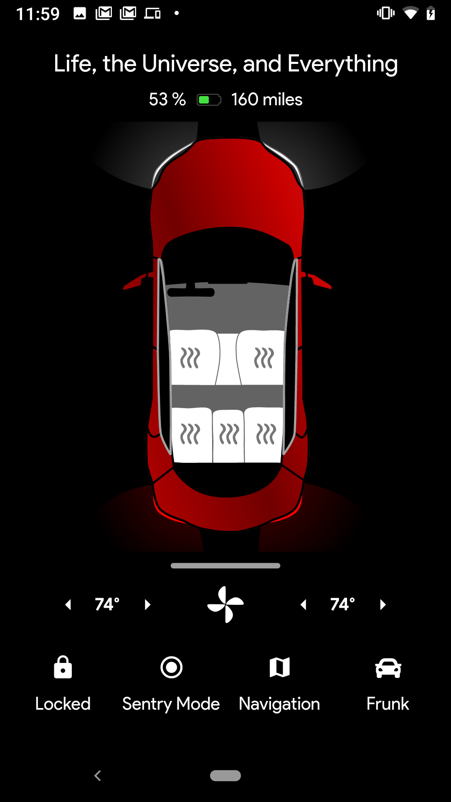
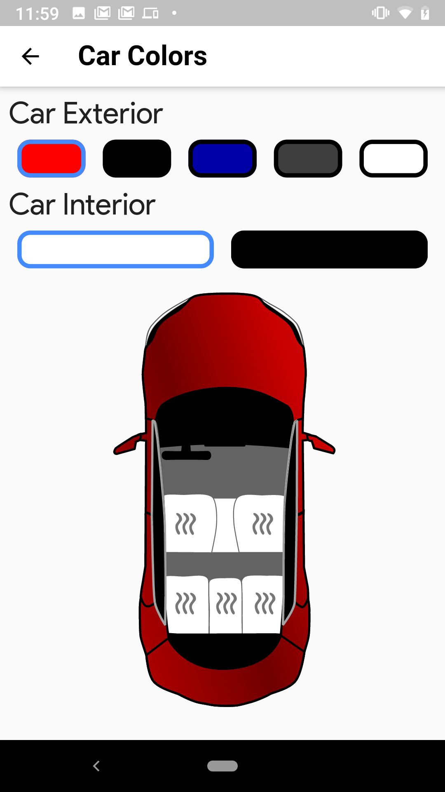

Great third party app to control your [Tesla](https://tesla.com) car.

## About

#### Dark Mode

Switch to a dark side. Light up the Tesla.

#### Offline Support

Built with speed in mind. Data saves locally for a faster launch.

#### Maps Support

Powered by Google Maps. Search for your car, current location or look up anything you want.

#### Pro Features

Made easy to get started, hard to master.

#### Easy to Tweak

Tweak car colors, settings and other app features.

#### Power Efficient

The app only updates when it needs to and thanks to the offline support it will use very little energy.

#### Nerd Stats

See all the raw data coming from your car and share it how you want.

#### Multiple Car Support

Control every Tesla in your garage.

#### Push Notifications

Receive important updates just when you need them.

#### Private

We do not use or want your personal data. Everything that belongs to you, stays with you.

Google Play             |  AppStore
:-------------------------:|:-------------------------:
  |  Coming Soon

## Screenshots

