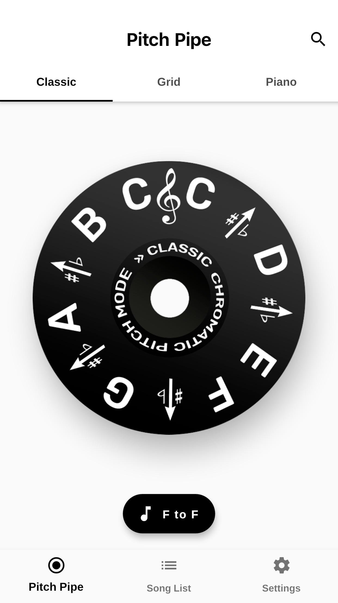
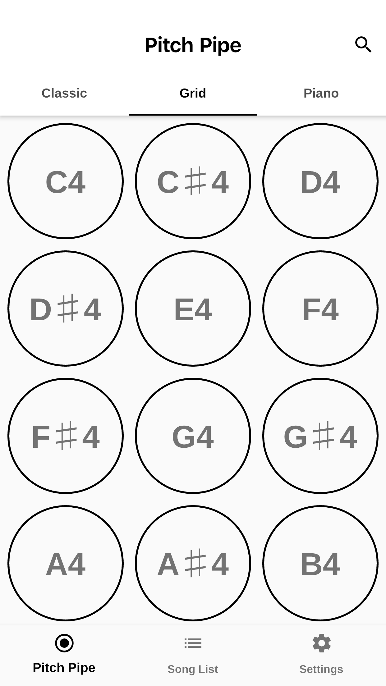

<iframe src='https://pitchpipe.app' height='600' width='100%'></iframe>

## About

Looking for the perfect pitch pipe companion? Need more features that just playing a note? Don't know how to read music?

This app is perfect for:
- Music Teachers and Students
- Song Leaders
- A Capella and Band Groups
- Solo Performers
- Students learning music
- Choirs and Music Groups
- Instrument Tuning

Features:
- Song List for Pre Selecting Pitches and Scales and arranging them into a list
- Note Helper for help with Sheet Music
- Classic C-C and F-F Pitch Pipes
- Modern Button Layout with C-C and F-F versions
- 3D Touch Quick Actions
- Apple Watch App with "C3" to "F4"
- Full iOS 11 Support
- Full iPhone X Support (Including True Black Theme)
- New interface for Pitch Pipe Tab so that it is simple to navigate
- Notes Field for Song List
- Share Button for Song List
- Today Widget for Sheet Music Help
- In app rating for a better App Store rating experience

Check out the Update!
⁃	Choose between 3 app icon and color
⁃	Add the widget to the home screen
⁃	Better performance
⁃	Tip Jar

## Screenshots

    