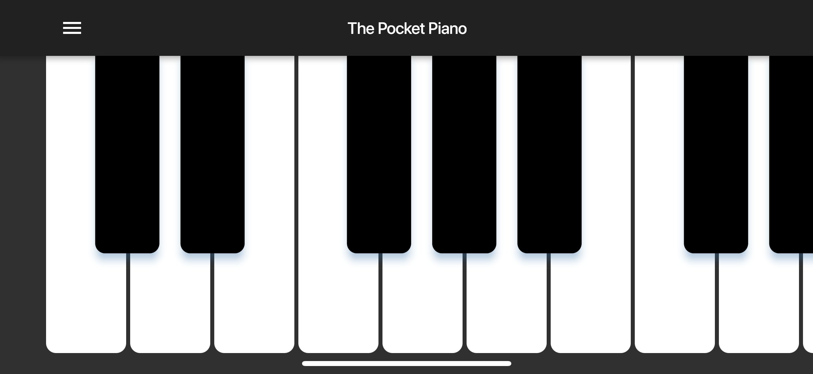
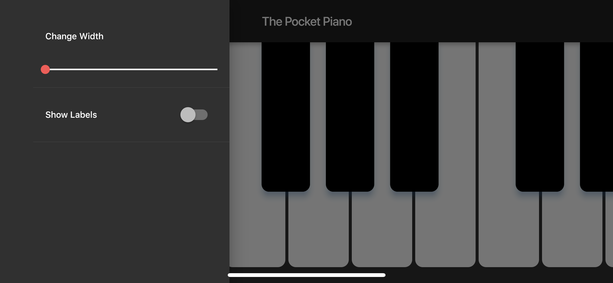

<iframe src='https://pocketpiano.app' width='100%' height='400'></iframe>

## About

The Pocket Piano is a fully featured piano optimized for all screen sizes.

Features:
- Adjustable key width
- Custom key labels
- Support for semantics for assistive screen readers
- Saved settings for every app launch
- Loud high quality piano
- iPad support for 2 rows of keys
- Octave section to jump to any section
- Disable Scroll
- Haptic Feedback on key press

Award winning app for the 2019 Flutter Create Contest!

## Screenshots

    