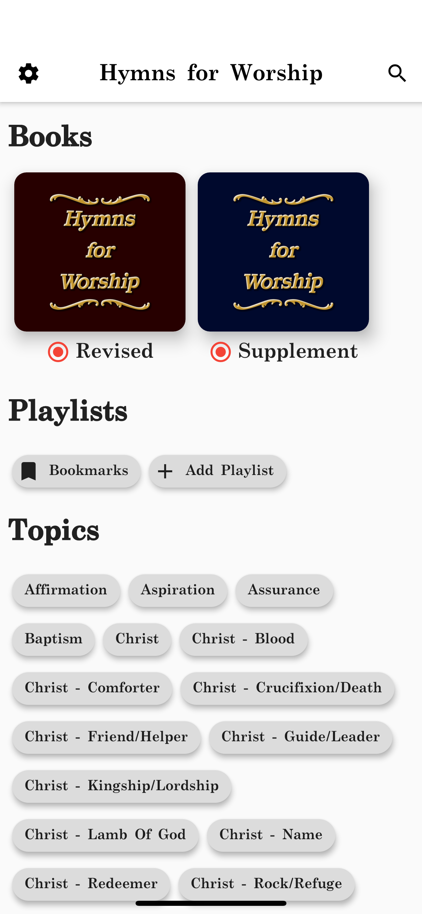

Companion app for [RJ Stevens Music](https://www.rjstevensmusic.com).

## About

Hymns for Worship is now digital. Enjoy all the features from the book plus rich search, integrated pitch pipe, and large easy-to-read text.

Hymns For Worship (Revised) Hymnal

This revised hymnal includes over 700 songs and hymns, as well as song leader assistance such as a pitch and directing guide, topical index, and shape notes. The hymnal is produced with large, clear and easy-to-read print including all lyrics and notes. The hardbound edition is available in navy blue and burgundy. A soft leatherbound edition is available in brown.

- Contains 700+ Songs and Hymns
- Pitch and Directing Guide
- Topical Index
- Shape Notes
- Large Clear, Easy-to-read words and notes

Hymns For Worship (Supplement) Hymnal

This collection of hymns, gospel songs, and contemporary praise and worship songs has been arranged for congregational singing. Churches will find this collection a singable and uplifting addition to their song worship.

- Great addition to ANY hymnal!
- Spiral bound, Ideal for song worship leaders in the pulpit.
- No annual copyright fees.
- Great for youth devotionals!
- 151 Selections (new and familiar hymns) with Topical Index guide and Pitch & Directing guide.

## Download

Google Play             |  AppStore
:-------------------------:|:-------------------------:
  |  

## Screenshots

