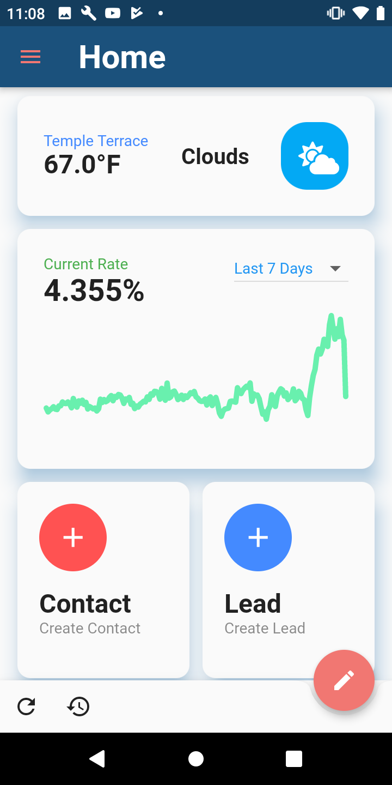
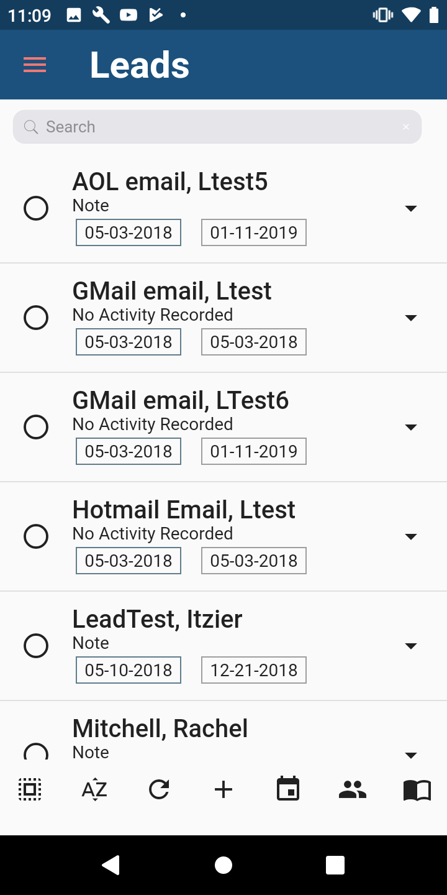
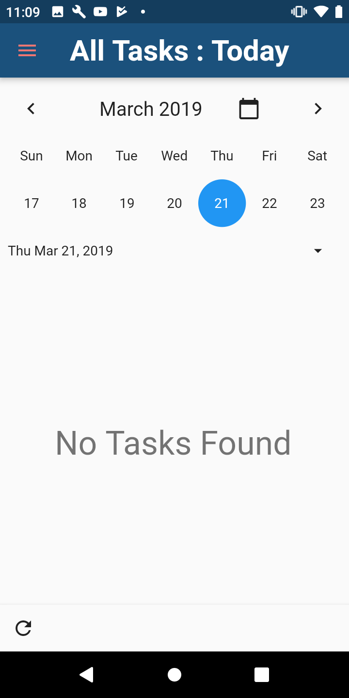

## About

[Unify](https://unifycrm.com) is pleased to announce the first complete Mobile CRM designed specifically for the mortgage industry. Loan originators can now leverage the full power of Unify CRM wherever they may be. With the Unify Mobile CRM app, you can add and view contacts, manage leads, set and receive reminders, view loan details, record and send videos, and much more. 

Unify Mobile CRM is the new and improved Unify Mobile and Unify Video rolled into one app. It’s the first true Mobile Customer Relationship Management tool designed to integrate with every aspect of your daily life. Being a native app on your device brings more capabilities from our web version to your fingertips. 

Being the first true mobile CRM for the Mortgage industry, we have launched this app with not only the mobile capabilities of a traditional CRM, but we have fully integrated all aspects of your phone to work with your CRM. 

Managing your contacts has never been easier with Unify Mobile CRM. 
Importing your phone contacts with a push of a button is not only easy: it also allows Loan officers to get out into the field to leverage more opportunities for your business. Customize your contacts by adding more information, such as contact groups, to your database. This not only helps keep an accurate account of your information, but also creates the perfect pair with your work station of Unify CRM on your desktop. 

#### Tasks, Appointments and Scheduled Calls 

Loan Officers will now have the power to view, schedule, and accomplish their tasks on the go. They can schedule their day ahead of time and integrate their tasks with their phone calendars so they never miss the perfect opportunity. 

#### Loan Pipeline

Being able to view loan pipelines, loan details and loan contacts will allow the loan officers to grab any information and details they might need for their meetings with real estate agents or key contacts. 

#### Video Marketing 

Unify Mobile CRM has brought in the Video aspects of marketing to your fingertips. Never miss the perfect opportunity to send a personalized video to business contacts, prior clients, or potential leads. The Video library has a completely new look that not only makes it easy to view, but also easy to send professional videos. 

#### Text Messaging 

Unify Mobile CRM has integrated with your phone's messaging system to be able to send text messages from most screens inside the app. Did you forget to send your client a reminder about documents still needed? No problem! Just open their contact record and select their phone number to send them a text message reminder. 

#### Customizable Dashboard

We have brought you an all-in-one dashboard to view everything a loan officer would need to complete their day. The widgets available can be removed or added based on personal preference and give any loan officer a personalized experience. 

#### Mortgage Calculator

Meeting contacts and potential leads while out of the office will never be a problem again. The Mortgage Calculator gives you a quick way to check calculations for accuracy. 

What are you waiting for? Download My Unify CRM app today to become the mobile loan officer you've always wanted to be! 

My Unify CRM is available for download for all Unify CRM clients. If your company does not utilize Unify CRM, please contact us today to find out how to become one of our valued clients at 866-497-3224 or visit our website for more information at www.unifycrm.com

## Download

Google Play             |  AppStore
:-------------------------:|:-------------------------:
  |  

## Screenshots

